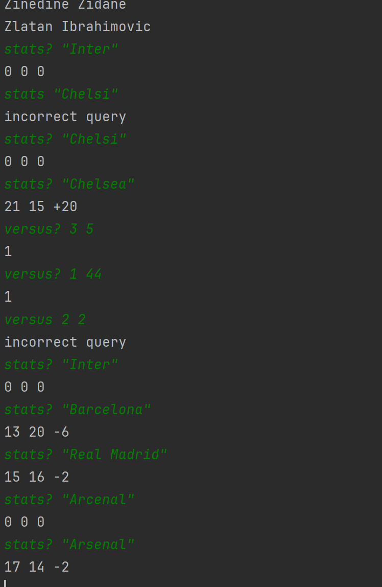

# Football Teams Analyzer ⚽

[](https://www.python.org/)
[](https://pypi.org/project/requests/)
[](https://pypi.org/project/python-dotenv/)

Инструмент для анализа статистики футбольных команд, игроков и матчей через API. Проект предоставляет:
- Статистику команд (победы/поражения/разница мячей)
- Список игроков с сортировкой
- Статистику встреч между игроками

## 📋 Содержание
- [Установка](#-установка)
- [Настройка](#%EF%B8%8F-настройка)
- [Использование](#-использование)
- [Функционал](#-функционал)
- [Структура проекта](#-структура-проекта)

## 📦 Установка

1. Клонируйте репозиторий:
```bash
git clone https://github.com/ваш-username/football-teams-analyzer.git
cd football-teams-analyzer
```
3. Создать виртуальное окружение
```bash
python -m venv venv
source venv/bin/activate  # Linux/MacOS
venv\Scripts\activate    # Windows
```
2. Установите зависимости:
```bash
pip install -r requirements.txt
```

## Конфигурация
Создайте файл .env в корне проекта:
```ini
API_KEY=your_secret_key
LOG_LEVEL=INFO
```

## Пример использования

<p align="center">
  
</p>